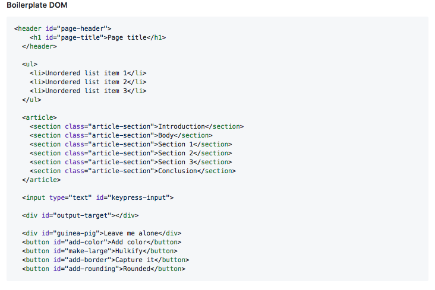
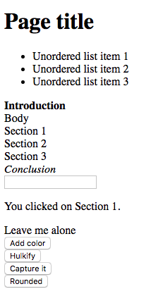
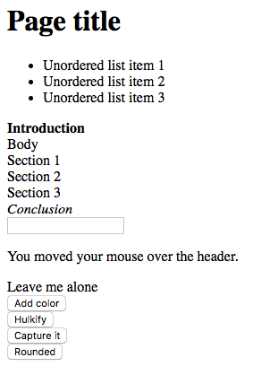
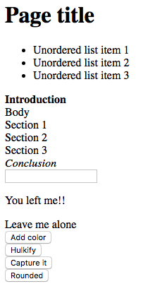
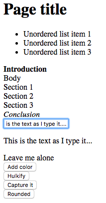
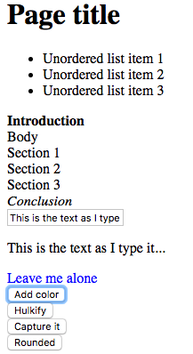
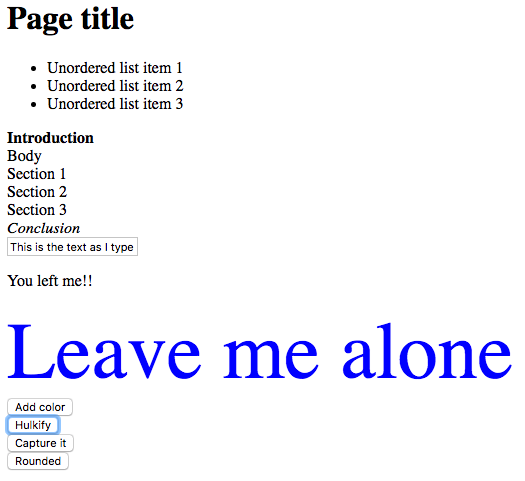
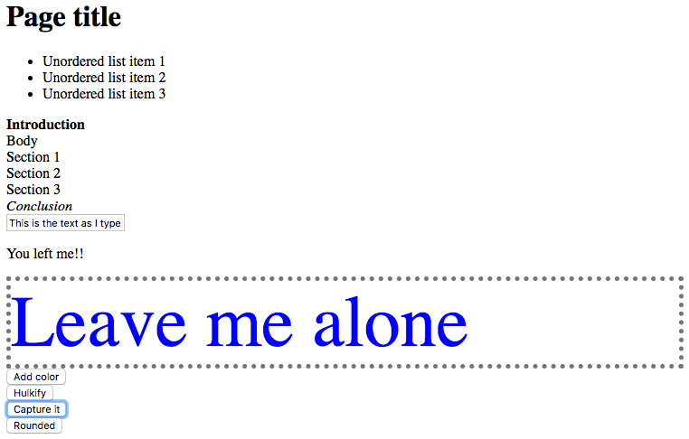
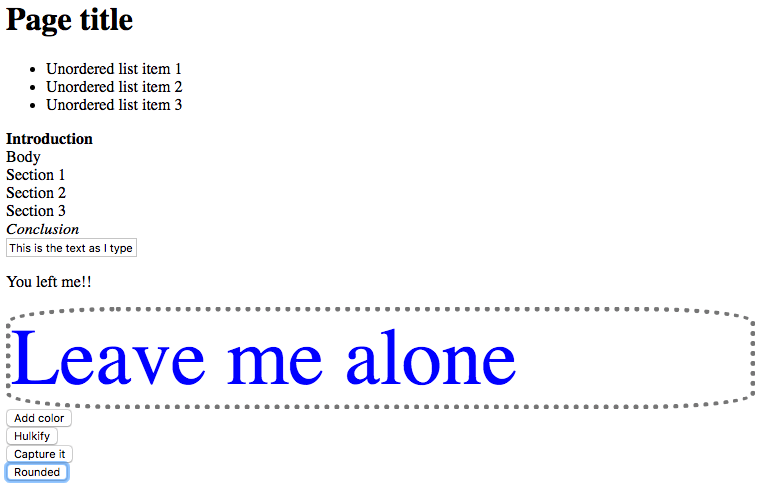

# Guinea-Pig
## Bootcamp Class Assignment

### Requirements
	1. There is sample HTML file content below so create an index.html for it and place the content in the body tag.

	2. Link in a JavaScript file named events.js.

	3. Link in a CSS file named events.css. You'll be using element.classList to manipulate the CSS classes on elements.

✏️ Output target is the output-target element.

	4. When any section is clicked the output target text should be "You clicked on the {text of the section} section" 

	5. When the mouse is over the h1 tag, the output element should contain the text "You moved your mouse over the header". 

	6. When the mouse leaves the h1 tag, the output element should contain the text "You left me!!". 

	7. When you type characters into the input field, the output element should mirror the text in the input field. 

	8. When you click the "Add color" button, the guinea-pig element's text color should change to blue. 

	9. When you click the "Hulkify" button, the guinea-pig element's font size should become much larger. 

	10. When you click the "Capture it" button, the guinea-pig element should have a border added to it. 

	11. When you click the "Rounded" button, the guinea-pig element's border should become rounded. 

	12. The first section's text should be bold.
	13. The last section's text should be bold and italicized.
	14. Make the buttons stop appearing next to each other as inline elements. Change them into block elements.

